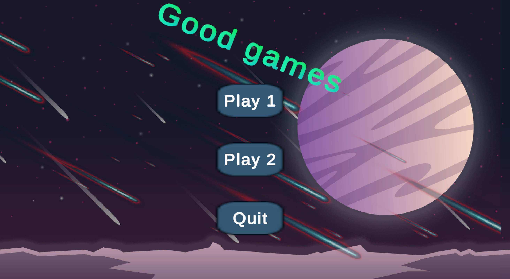
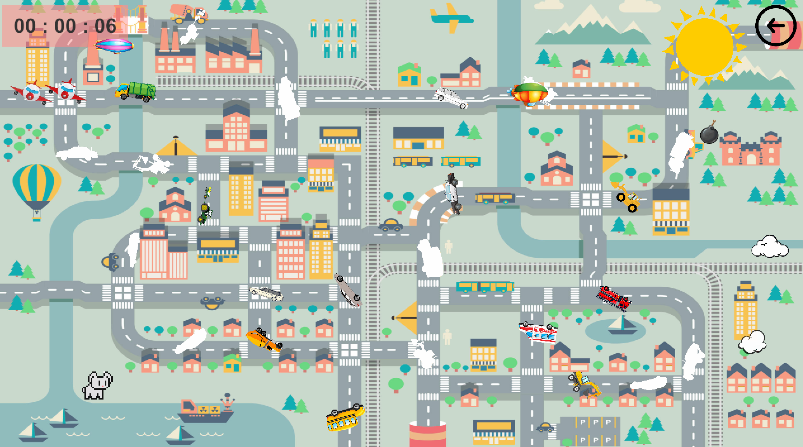

# DragAndDropGames
Unity 2D Drag And Drop games for children +6

A simple and colorful 2D Unity game where players drag cars onto their correct places on the map.
The game includes sound effects, animations, and an interactive main menu.

Features

* 🏙️ City map with interactive objects
* 🚗 Drag & Drop mechanics
* 🔊 Fun sound effects
* ⏱️ Game timer (HH:MM:SS)
* ✈️ Moving obstacles
* 🎬 Animated main menu (3 buttons + effects)
* 📸 Camera zoom & movement limits

🛠️ To-Do Progress

Development checklist:
- [x] Create the necessary folders 
- [x] Add necessary assets 
- [x] Add cars on the map
- [x] Create C# script for drag and drop
- [x] Create C# script for transformation
- [x] Create C# script for object fixation
- [x] Add necessary sounds and audio sources
- [x] Create logic for winning
- [x] Create camera script for zoom-in/out and camera restrictions
- [x] Create animated main menu with 3 buttons, sound, animated objects 
- [x] Create C# script for scene change and quit option
- [x] Create game timer (HH:MM:SS)
- [x] Add flying obstacle in a city scene

Created by Artjoms